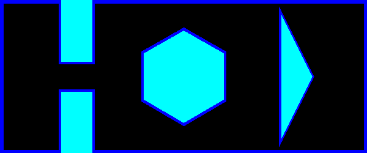

# Overview
ENPM661 Project 2
* Yashveer Jain
* 119252864

## Map


## Instruction 
* run
> python3 djikstra_yashveer_jain.py --start_pos 6 6 --goal_pos 550 225
* output
```
Start Pos recieved :  [6, 6]
Goal Pos recieved :  [550, 225]
Started Searching-----------
Got the goal Node!
Backtracking -------
Start -> goal nodes ---
(6, 243)
(6, 242)
(6, 241)
.
.
(550, 24)
```
* Output:
    - optimal_path.avi
    - map.png
    - node_Exploration.avi

* Note :
    - uncomment line 360 for plotting whole node exploration.
    - But it takes > 10 mins to record.

## Dependencies
* numpy
* opencv

## Note
* For triangle obstacle, adding clearance blocking the path of the map, so reduce the clearance from 5 to 3, only for triangle 2 edges, to reduce the obstacle space for Triangle